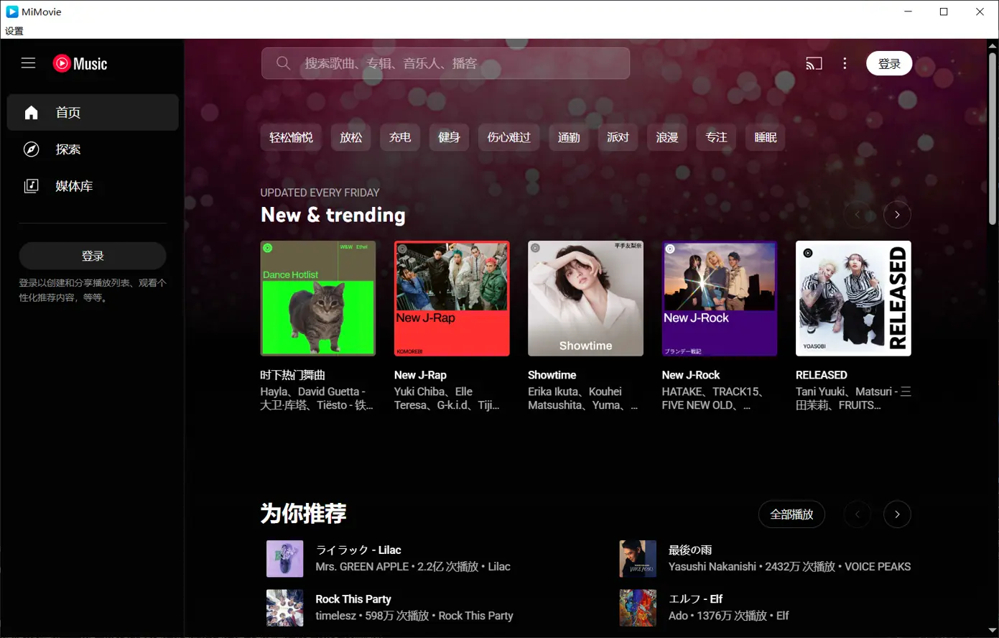

# MiMovie

背景：比如需要在多地访问某个网站，但有的支持直接访问（有时又特别屏蔽了部分站点…），有的需要特殊方式。站点涉及到一些变动的域名，加规则麻烦，其实 chromium 使用命令行指定 proxy + userdata 可以解决。简单来说是不想污染规则与常用浏览器。

只需要 win 平台，所以选择了一个比较小众的可以快速构建出不大于 3M 的 exe。

## 功能

- 支持设置代理
- 支持设置网站
- 支持修改 userData
- 支持加载插件，将插件放入 `/extension` 目录即可

## 截图

